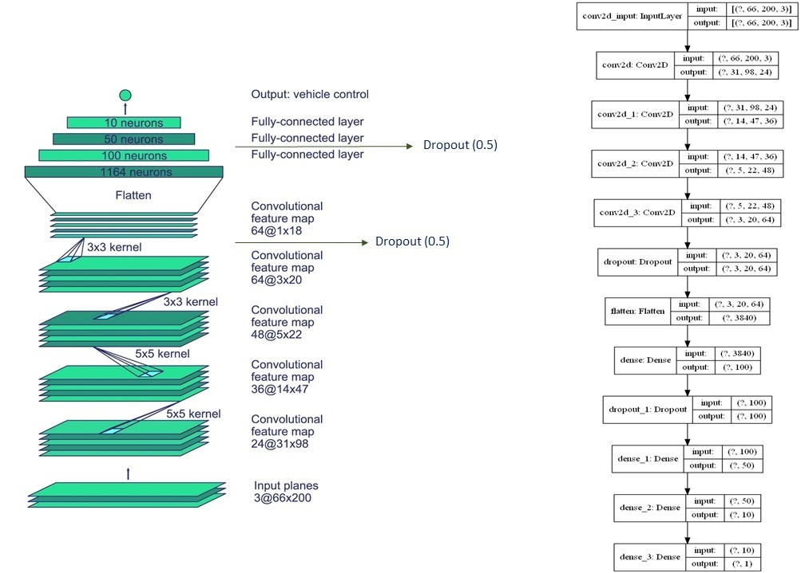
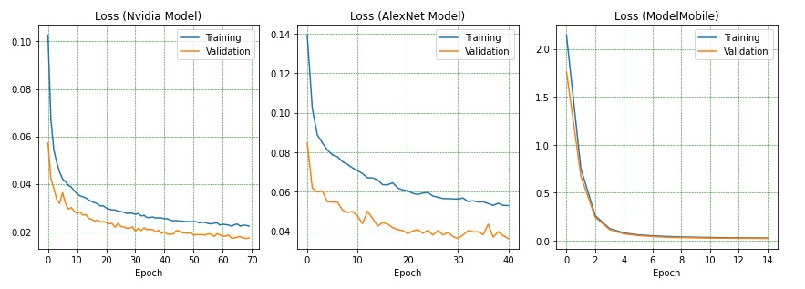

# SDC_Project
#### *Final project of Brainster Data Science Academy*

## Content:

#### Overview / Implementation / Results / Conclusion / References

### Overview
---
#### Intro:

The goal of our final project was to use end-to-end learning for self-driving cars, also known as Behaviour Cloning, based on Nvidia paper [1]. In order to achieve this, we used the Udacity Car Simulator powered by Unity [2]. Data was collected with manual driving the training track of the simulator using mouse, thus to achieve more smoothness of the driving trajectory. When driving run was finished the simulator generated the data that included three images and steering angle per each frame. The data then was separated into two segments: features that contained images and label that containd appropriate steering angle. After, data acquisition the next few stages were preprocessing and data augmentation, which ended with fabrication of the relevant dataset. In the training phase we constructed the Nvidia CNN model and two additional models for comparison, one based on AlexNet the other on MobileNet. Finally, in the last stage of the development we made analysis and visualization of the results, followed by autonomous driving on the challenge track by our best Nvidia model.

Training | Validation
------------|---------------
 | 

#### Dependencies:

The following Python libraries were utilized:

| Library | Version |
| ----------- | ----------- |
| Keras | 2.4.0 |
| TensorFlow | 2.3.0 |
| Eventlet | 0.30.2 |
| Flask | 1.1.2 |
| Sklearn | - |
| Pillow | 8.2.0 |
| Flask-SocketIO | 5.0.1 |
| Opencv | 4.0.1 |
| Pandas | 1.2.4 |
| Numpy | 1.18.5 |
| Imgaug | 0.4.0 |
| Matplotlib | 3.3.4 |

#### Files:

SDC_project includes the following files:
* ```SDC_model.ipynb``` containing the script to create and train the model.
* ```drive.py``` containing the script for driving the car in autonomous mode.
* ```model.h5``` containing the trained Nvidia convolution neural network.
* ```SDC_Dataset``` containing the simulator data for training.  
* ```README.MD``` containing the summary of the project.
* ```Dependencies``` containing all the libraries used in the project.
* ```Images``` containing images for building README.MD.
* ```Videos``` containing video recording of the car performance on autonomous mode on different tracks.

#### How to Run the Model:

This repository comes with trained model which you can directly test using the following command:

- `python drive.py model.h5`


### Implementation
---
#### Simulator Environment:

About the graphic configuration of the simulator we decided to be lower graphical quality and lower screen resolution, in our case: fastest with 800 x 600, this decision is based on research for previous users’ experience. The simulator is equipped with training mode and autonomous mode. Training mode is used for collecting data, on the other hand, autonomous mode is used to test your model performance or in other words cars behavior while driving on its own. Top view of the representative track used for autonomous driving is presented below [3]: 

Simulator Top View | 
----|
 | 

While the car was driving in manual mode, the images from the cameras mounted on top of the car were recorded together with the steering angle for that frame, illustrated below. The data from all three cameras mounted on top of the vehicle was recorded and stored together with information about steering angle for a particulare frame.

Cameras Positions | 
----|
 | 

#### Dataset Collection:

Data collection was done while the vehicle was driving in manual mode on the representative track. Image data were acquired from the three cameras mounted on the vehicle in the simulator environment. At the end of the mouse ride, the images were stored together with the table containing information about image titles, steering angle values per each recorded frame and information about throttle, brake and speed. An example of images recorded by all the three cameras in one frame is presented below:

Images Recorded | 
----|
 |

Three cameras were used for training purpose. During the data collection, time-stamped video from the cameras is captured simultaneously with the steering angle applied by the human driver. The slight difference in the field of view per each central, left, and right camera leads to a better generalization of the model. Simplified block diagram of the collection system for training data is illustrated below:

Data Collection System | 
----|
 |

Visualization of the steering angle distribution for better understanding the nature of the driving performance:

Steering Angle Distribution | 
----|
 |

#### Dataset Augmentation:

After data collection we applied data augmentation techniques. One of the most important features that our neural network had to learn was the curves. A simple method to double the dataset size and put the focus on curves was data augmentation. The following techniques are used:

* Random Zoom 
* Random Translate 
* Random Brightness 
* Random Gaussian Blur
* Random YUV Transformation

Data Augmentation | 
----|
 |

#### Dataset Preprocessing:

For training the convolutional neural network, images acquired from all three cameras were used (central, left, and right). All of these images captured a similar scene but from slightly different positions. Advantages of using three cameras instead of one central camera are three times more data, and better performance for steering back to the center scenario when the vehicle starts drifting off to the side. Cropping was used in order to remove the parts of the image that do not have valuable information for the training process, so as to remove the sky, threes and hills on the top of image. After, removing unnecessary segments of the images we resized them for introduction to the input layer. Finally, the images from dataset were normalized by dividing each pixel of the image by 255, which is the maximum value of an image pixel, obtaining a normalized image in range between 0 and 1. An example of the image after cropping is presented below:

Data Preprocessing | 
----|
 |

#### Dataset:

The total number of acquired samples was 20057 images with a resolution of 200 x 200 x 3. Each recorded image was 200 pixels high, 200 pixels wide, and three channels deep color RGB image. The average memory size of one recorded image was about 15 kB. Each image was paired with the corresponding steering angle value that was normalized in range between −1 and 1. After applying data augmentation, dataset become 60159 samples in total. The data was split into training and test segments, where 80% of data was chosen for training, 48127 samples, and 20% of the data for the test, 12032 samples. The shape of the images was 66 x 200 x 3, which was the input shape.

| Parameters | Training | Test | Total |
| ----------- | ----------- | ----------- | ----------- |
| Number of Samples | 48127 | 12032 | 60159 |
| Percentage of Total Dataset| 80% | 20% | 100% |

Final illustration of y_train and y-test distributions for training and validation are shown below:

y-Segments Distributions | 
----|
 |

#### Model:

Our convolutional neural network architecture was replica on NVIDIA's End-to-End Learning for Self-Driving Cars model.

Nvidia Model | 
----|
 |

The training process is as follows: proposed angle is compared to the desired angle for a input image, and the weights of the Convolutional Neural Network (CNN) are adjusted to bring the CNN output closer to the desired output. The weight adjustment is accomplished using back propagation as implemented in the Keras machine learning package. Illustration of the described training process can be seen below:

Training Process | 
----|
 |

### Training:

After appling all the preprocessing and augmentation techniques, the training dataset was substantial large in size. Thus, we need to consider a `generator` approach for our training process.

We created two generators in order to bridge this memory shortage:
* `batch_generator()`
* `fit_generator()` but in Keras that was now just `fit()`

This was the settings that were untilized for our generator:

- steps_per_epoch = 300
- epochs = 70
- validation_steps = 200
- shuffle = 1

### Comparison Models:

Two additional models were created and trained in order to facilitate comparison frame. The goal here was to make comparison between different model architectures and our model of interest. The description of the comparison models as follows:

- Simplified version of AlexNet to encapsulate the problem scenario [4].
- Transfer learning approach with MobileNet as nested pretrained model [5]. 

### Results
---

The suggested deep neural network Nvidia was compared with simplified model based on AlexNet and transfer learning model based on MobileNet, which we re-implemented in order to conduct an objective performance evaluation of our DNN model of interest. The models of all three network architectures were implemented, trained with the same dataset, and trained models were used for inference, first on validation dataset and later in the simulator for autonomous driving. The results were compared in terms of performance, successfully driving on the representative track, and in terms of complexity of the network and number of trainable parameters.

#### Models Performance:

Errors summarizes on average how close predictions were to their expected values.
These are three error metrics that we used for evaluating and reporting the performance of our models, they are:

- Mean Squared Error (MSE).
- Root Mean Squared Error (RMSE).
- Mean Absolute Error (MAE)

| Metrics | Nvidia | AlexNet | MobileNet |
| ----------- | ----------- | ----------- | ----------- |
| MSE | 0.0170 | 0.0361 | 0.0222 |
| RMSE | 0.1304 | 0.1901 | 0.1490 |
| MAE | 0.0952 | 0.1461 | 0.1116 |

Model loss for training and validation for Nvidia, AlexNet and MobileNet, which is clear representation of the models training process:

Models Loss | 
----|
 |

#### Validation on Dataset:

Untilizing the validation dataset to make predictions for steering angle, represented as steering angles between -1 and 1 (rad) values:
- Ground Truth plotted with green color.
- Nvidia model plotted with magenta color.
- AlexNet model plotted with orange color.
- ModelMobile plotted with blue color.

Models Performance | 
----|
 |

#### Approximated Accuracy: 

- Approximate Accuracy evaluated by predefined treshold of 0.26 radians ~ (15 degrees).
- Approximate Accuracy evaluated on basis of mislabeled prediction.

Approximated Accuracy Performance | 
----|
 |

#### Simulator Validation:

After we trained the model and evaluated on validation dataset the final step is to assess its performace on the challenge track on the Udacity Simulator. The procedure for this phase is illustrated below:

Assessment Stage | 
----|
 |

 The Nvidia model network performance in the simulator environment on autonomous mode:

| Training Track 1 | Training Track 2 | Challenge Track |
|:-----------:|:----------:|:---------:|
| [](https://www.youtube.com/watch?v=q-ewsdm0ll4) | [](https://www.youtube.com/watch?v=JSjuFLVDLQA) | [](https://www.youtube.com/watch?v=jH5hXtbEXg4) |

### Conclusion
---

In this project, we were able to successfully predict the steering angles using convolutional neural networks and were able to understand the inner details of convolutional neural networks along with the way they can be tuned. We also demonstrated that CNN’s are able to learn the entire task of lane and road following without manual decomposition into road or lane marking detection, semantic abstraction, path planning and control. A small amount of training data from simulator environment was sufficient to train the car to operate in unknown road and scenery. An interesting caveat to this is that the neural network was able to successfully drive on this track that it had not been trained on. Finally, the task defined in our academy project was successfully accomplished [6].

Further extensions and future direction:
- Continue the work in the field of Self Driving Cars in more depth such as: dataset, preprocessing techniques and model development.
- Adapt the model network architecture for implementation on embedded system to assess its interaction in real world scenarios.

### References
---

- [1] https://images.nvidia.com/content/tegra/automotive/images/2016/solutions/pdf/end-to-end-dl-using-px.pdf
- [2] https://github.com/udacity/self-driving-car-sim
- [3] https://www.ncbi.nlm.nih.gov/pmc/articles/PMC6539483/
- [4] https://scholarworks.calstate.edu/downloads/fx719m76s
- [5] https://keras.io/api/applications/mobilenet/
- [6] https://bhargav265.github.io/Simulation_of_self_driving_car/ArtificialLifeReport.pdf
